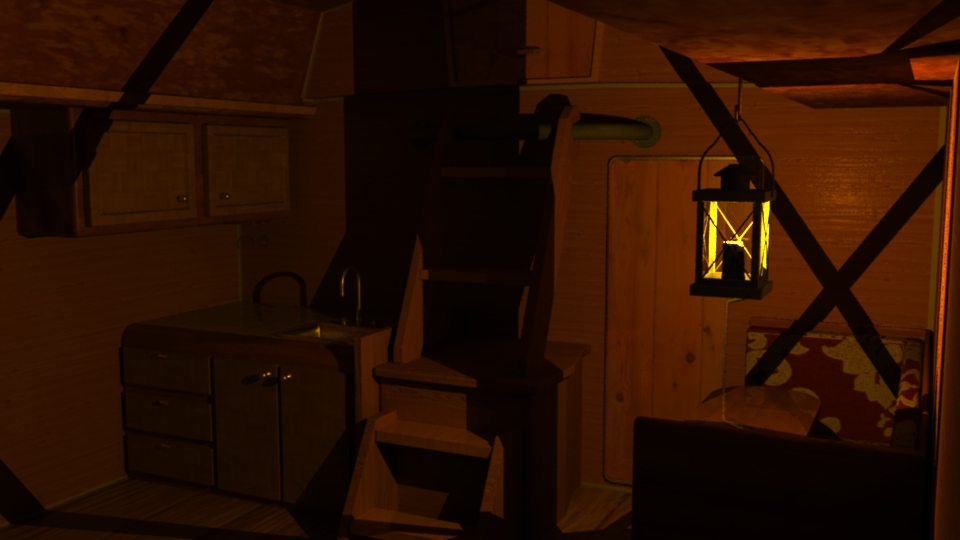
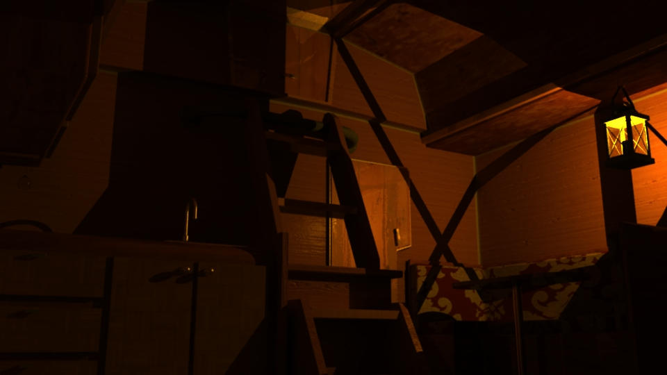
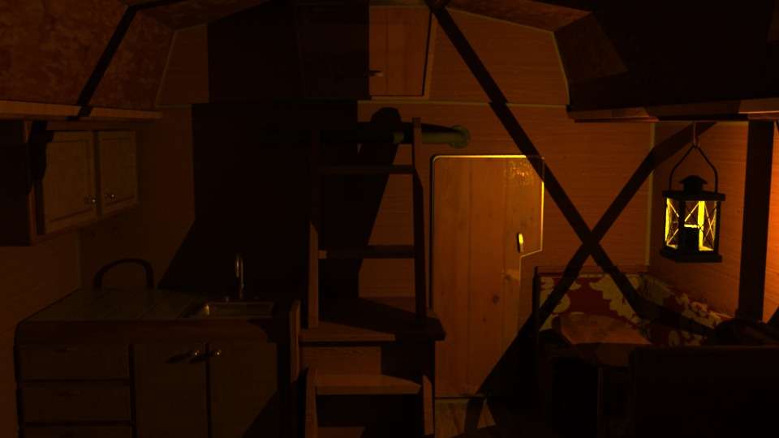
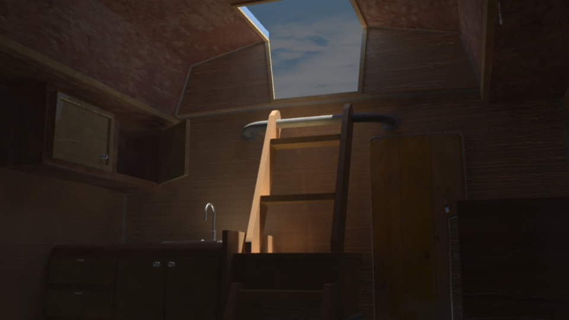
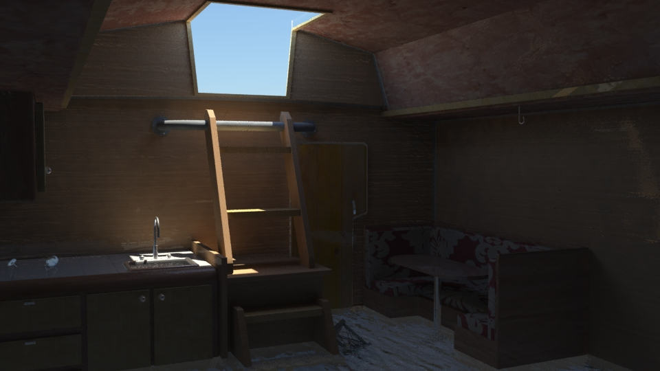
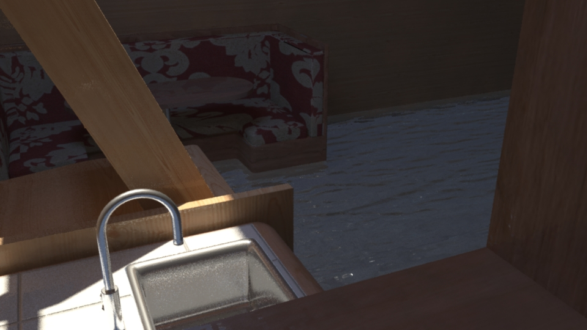

#3D Modeling Scene Project
##Description
This project displays the interior of a sail boat during and after a tropical storm.  The 3D models were built from scratch using Autodesk Maya and the textures were retrieved from [textures.com](http://)
##Screen Shots
Scene 1

Scene 2

